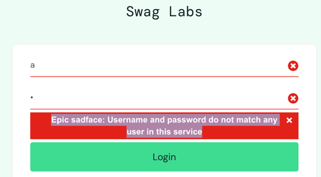

**Title:** English used in Login page error is not correct. 

**ID:** BUG-001

**Reported By:** William Walsh  
**Date:** 04/11/2024
**Environment:**
- **Operating System:** Common across
- **Browser:** Chrome 130.0.6723.92
- **Application Version:** v?.?.?

**Severity:** Low  
**Priority:** P4 (Negligible)

**Description:**  
When a user logs in with invalid credentials, the error text contains a string that is not correct. This issue occurs consistently across multiple browsers.

**Steps to Reproduce:**
1. Open the browser and navigate to the login page.(https://www.saucedemo.com/)
2. Enter an invalid username and password.
3. Click on the "Login" button.
4. Observe the error message:
```
Epic sadface: Username and password do not match any user in this service.
```
**Expected Result:**  
Upon entering invalid credentials and clicking the login button, the error should use correct english.

**Actual Result:**  
The page displays the incorrect statement: "Epic sadface..."

**Attachments:**
- Screenshot of the incorrect english 

**Workaround (if any):**  
None.